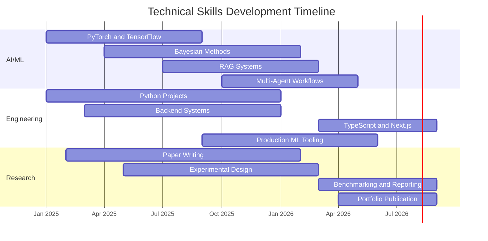

# 👋 Hi, I'm Zhichao Pan

🎓 **Computer Science Student** @ Yangzhou University Guangling College 
💻 **AI Researcher & Developer** building applied ML, RAG, multi-agent systems, and AI products 
🚀 Currently focused on reliable AI engineering, uncertainty-aware modeling, and practical full-stack AI apps

  
  
  
  
  
  

## 🎯 About Me

I'm interested in building AI systems that are not only impressive in demos, but also measurable, reproducible, and useful in real-world settings. My current work spans **AI for science**, **uncertainty quantification**, **financial document intelligence**, **multi-agent reasoning**, and **AI-powered SaaS products**.

I like projects where research ideas meet engineering discipline: clean experiments, transparent evaluation, and systems that can be shipped, inspected, and improved.

## 🔥 Technical Focus

### 🧠 AI / Machine Learning
- **Deep Learning**: PyTorch, TensorFlow, Transformers, CNNs, ResNet, LSTM
- **Uncertainty & Bayesian Methods**: PyMC, Bayesian inference, HDI coverage, uncertainty quantification
- **NLP & RAG**: LlamaIndex, LangChain, Hugging Face, embeddings, document parsing
- **Multi-Agent Systems**: LangGraph, agent orchestration, local LLM workflows
- **Applied AI**: Battery prognostics, financial analysis, scientific computing

### 💻 Software Engineering
- **Languages**: Python, TypeScript, Java, C, JavaScript
- **Backend**: FastAPI, Flask, PostgreSQL, MongoDB, Redis
- **Frontend**: React, Next.js, Tailwind CSS
- **DevOps**: Docker, GitHub Actions, CI/CD, reproducible experiment pipelines
- **Cloud & Tooling**: AWS, GCP, Azure basics, MLflow, Weights & Biases

### 📊 Research & Data
- **Evaluation**: Benchmarking, ablation studies, reproducibility, error analysis
- **Statistics**: Hypothesis testing, Bayesian modeling, experimental design
- **Visualization**: Matplotlib, Seaborn, Plotly
- **Research Practice**: Literature review, paper writing, conference preparation

## 🏆 Featured Projects

### 🆕 LaunchLens AI

**AI-powered SaaS go-to-market workspace portfolio project**
- **Tech Stack**: TypeScript, full-stack product engineering, AI workflow design
- **Focus**: Product strategy, workflow automation, SaaS interface design
- **Status**: Actively updated in June 2026

### 🔋 Safety-Critical Battery Prognostics

**A reproducible battery prognostics repository with physics-aware evaluation and uncertainty reporting**
- **Tech Stack**: PyMC, PyTorch, NASA PCoE Dataset
- **Key Result**: Safety-focused RUL prediction with uncertainty-aware evaluation
- **Impact**: Battery health management, autonomous systems, safety-critical ML

### 📊 Structure-Aware Financial RAG

**Financial document parsing with a 37.5% accuracy improvement on complex tabular reasoning**
- **Tech Stack**: LlamaParse, RAG, DeepSeek-R1, BGE embeddings
- **Key Result**: 50.0% → 68.8% accuracy improvement
- **Impact**: SEC filing analysis, financial document intelligence, table-aware retrieval

### 🤖 LangGraph Financial Swarm

**Multi-agent system for financial reasoning and local LLM workflows**
- **Tech Stack**: LangGraph, multi-agent systems, Ollama, local LLMs
- **Key Result**: 88.4% accuracy with a 4.2% hallucination rate
- **Impact**: Automated financial research and investment analysis workflows

### 🌐 Personal Website

**Personal portfolio and digital garden built with Next.js and AI-integrated workflows**
- **Tech Stack**: TypeScript, Next.js, modern frontend engineering
- **Focus**: Personal knowledge systems, portfolio design, AI-assisted publishing

## 📈 GitHub Analytics

  
  

  
  

  

## 🧭 2026 Roadmap

### 🎓 Academic & Research
- Continue research in **AI for Science**, **uncertainty quantification**, and **reliable ML**
- Prepare stronger graduate-school and research-portfolio materials
- Turn project work into reproducible reports, benchmarks, and paper-ready artifacts

### 💼 Engineering & Product
- Build more complete AI applications with clear user workflows and measurable outcomes
- Strengthen full-stack TypeScript / Next.js product engineering
- Improve deployment, observability, and documentation across portfolio projects

### 📚 Learning Focus
- Bayesian deep learning and causal ML
- Distributed ML systems and production ML infrastructure
- Healthcare AI, climate science, battery systems, and financial AI

## 📊 Project Snapshot

| Project | Area | Main Stack | Highlight |
|--------|------|------------|-----------|
| [LaunchLens AI](https://github.com/Zhi-Chao-PAN/launchlens-ai) | AI SaaS | TypeScript | AI-powered go-to-market workspace |
| [Battery Prognostics](https://github.com/Zhi-Chao-PAN/safety-critical-battery-prognostics) | AI for Science | PyMC, PyTorch | Uncertainty-aware battery RUL modeling |
| [Structure-Aware RAG](https://github.com/Zhi-Chao-PAN/structure-aware-rag-empirical) | Financial AI | RAG, LlamaParse | +37.5% accuracy on tabular reasoning |
| [Financial Swarm](https://github.com/Zhi-Chao-PAN/LangGraph-Financial-Swarm) | Multi-Agent AI | LangGraph, Ollama | 88.4% accuracy, 4.2% hallucination rate |
| [Personal Website](https://github.com/Zhi-Chao-PAN/personal-website) | Portfolio | Next.js, TypeScript | AI-integrated digital garden |

## 🏅 Skills Progression

## 📝 Latest Updates

- ✅ **2026-06**: Added [LaunchLens AI](https://github.com/Zhi-Chao-PAN/launchlens-ai), an AI-powered SaaS go-to-market workspace project
- ✅ **2026-04**: Continued work on safety-critical battery prognostics and uncertainty-aware evaluation
- ✅ **2026-03**: Published financial RAG and multi-agent financial analysis projects
- 🎯 **Next**: Convert project work into stronger writeups, demos, and reproducible evaluation reports

## 📬 Let's Connect

  
  

I'm open to:
- 🤝 Collaboration on AI/ML research and product projects
- 📝 Code review, benchmark design, and technical discussion
- 💡 Idea exchange around reliable AI systems and applied research

---

  <i>"The science of today is the technology of tomorrow." — Edward Teller</i>

  
  
  

  Made with ❤️ by <a href="https://github.com/Zhi-Chao-PAN">Zhichao Pan</a> 
  Last Updated: June 13, 2026

