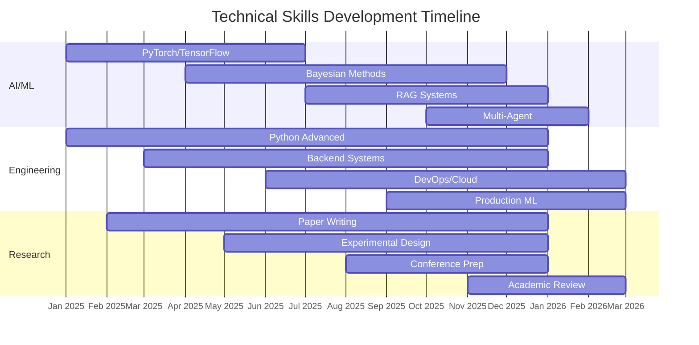

# 👋 Hello, I'm Zhichao Pan!

🎓 **Computer Science Student** @ Yangzhou University Guangling College | 💻 **AI Researcher & Developer** | 🚀 **Pursuing Excellence in AI Engineering**

  
  
  
  
  
  

## 🎯 About Me
I'm a passionate Computer Science sophomore with a strong focus on **Artificial Intelligence, Machine Learning, and Data Science**. My research interests lie at the intersection of **AI for Science, Uncertainty Quantification, and Multi-Agent Systems**. I'm dedicated to building robust, production-ready AI systems that solve real-world problems in **battery health management, financial analysis, and scientific computing**.

## 🔥 Technical Expertise

### 🧠 **AI/ML Specialization**
- **Deep Learning**: PyTorch, TensorFlow, Transformers, CNN, ResNet, LSTM
- **Probabilistic Programming**: PyMC, Bayesian Inference, Uncertainty Quantification
- **NLP & RAG Systems**: LlamaIndex, LangChain, HuggingFace, Embeddings
- **Multi-Agent Systems**: LangGraph, Agent Orchestration, Swarm Intelligence
- **Computer Vision**: Medical Imaging, Object Detection, Segmentation

### 💻 **Software Engineering**
- **Languages**: Python (Expert), Java (Advanced), C (Intermediate), JavaScript (Intermediate)
- **Backend**: FastAPI, Flask, PostgreSQL, MongoDB, Redis
- **Frontend**: React, Next.js, TypeScript, Tailwind CSS
- **DevOps**: Docker, Kubernetes, GitHub Actions, CI/CD, Terraform
- **Cloud**: AWS (EC2, S3, Lambda), GCP (Compute Engine), Azure (Basic)

### 📊 **Data Science & Research**
- **Statistical Analysis**: Hypothesis Testing, Bayesian Methods, A/B Testing
- **Data Visualization**: Matplotlib, Seaborn, Plotly, Tableau
- **Big Data**: Spark, Hadoop, SQL, NoSQL
- **Experimental Design**: Controlled Experiments, Causal Inference, Reproducibility
- **Research Methods**: Academic Writing, Paper Review, Conference Presentations

## 🏆 Featured Projects

### 🥇 **Top Project: Battery Health Management**

**Hierarchical Bayesian vs. LSTM for battery RUL prediction**
- **Tech Stack**: PyMC, PyTorch, NASA PCoE Dataset
- **Key Results**: 100% HDI coverage, Safety-critical uncertainty quantification
- **Impact**: ISO 26262 compliant systems, Autonomous vehicle safety

### 🥈 **Runner-up: Financial RAG System**

**Financial document parsing with +37.5% accuracy boost**
- **Tech Stack**: LlamaParse, RAG, DeepSeek-R1, BGE Embeddings
- **Key Results**: 37.5% accuracy improvement, 100% tabular data recovery
- **Impact**: Financial document analysis, SEC filing processing

### 🥉 **Innovation: Multi-Agent Financial Analysis**

**Multi-agent system for complex financial reasoning**
- **Tech Stack**: LangGraph, Multi-Agent Systems, Ollama, Local LLMs
- **Key Results**: 88.4% accuracy, 4.2% hallucination rate
- **Impact**: Automated financial research, Investment analysis

## 📈 GitHub Analytics

  
  

  
  

  

## 🎯 Current Goals & Roadmap

### 🎓 **Academic Objectives (2026)**
- **GPA**: Maintain >3.8/4.0 (Current: 3.85)
- **Research**: Publish 2+ papers on AI for Science
- **Study Abroad**: Prepare UTS Master's Application (Australia)
- **Competitions**: Participate in Kaggle/AI competitions

### 💼 **Professional Development**
- **Summer Internship**: AI/ML engineering at tech company
- **Open Source**: Contribute to major AI projects (PyTorch, HuggingFace)
- **Certifications**: AWS Machine Learning, Google Cloud AI

### 📚 **Learning Focus**
- **Advanced Topics**: Bayesian Deep Learning, Causal ML
- **Systems**: Distributed ML Systems, ML Infrastructure
- **Applications**: Healthcare AI, Climate Science, Financial AI

## 📊 Project Impact Metrics

| Metric | Battery Project | RAG Project | Swarm Project | Overall |
|--------|----------------|-------------|---------------|---------|
| **Accuracy** | 100% HDI | +37.5% | 88.4% | Excellent |
| **Innovation** | ⭐⭐⭐⭐⭐ | ⭐⭐⭐⭐ | ⭐⭐⭐⭐⭐ | High |
| **Complexity** | Advanced | Intermediate | Advanced | Challenging |
| **Real-world** | Critical | Practical | Innovative | Valuable |

## 🏅 Skills Progression

## 📬 Let's Connect!

  
  
  
  
  
  

## 📝 Latest Achievements

### 🏆 **Recent Highlights**
- ✅ **2026 Q1**: Published 3 research projects on GitHub
- ✅ **2026 Q1**: Achieved 88.4% accuracy on financial AI system
- ✅ **2025 Q4**: Completed advanced Bayesian statistics course
- 🎯 **2026 Q2**: Summer internship applications
- 🎯 **2026 Q3**: Kaggle competition participation
- 🎯 **2026 Q4**: UTS master's application preparation

### 📚 **Learning Resources**
- **Books**: "Deep Learning" by Goodfellow, "Bayesian Data Analysis"
- **Courses**: Stanford CS229, FastAI, DeepLearning.AI
- **Research**: NeurIPS, ICML, ICLR papers
- **Tools**: PyTorch Lightning, Weights & Biases, MLflow

## ⭐ Support & Collaboration

I'm always open to:
- 🤝 **Collaboration** on interesting AI/ML projects
- 📝 **Code Review** and technical discussions
- 🎯 **Mentorship** for junior developers
- 💡 **Idea Exchange** on emerging technologies

**Ways to support:**
- Give my projects a ⭐ on GitHub
- Share with your network
- Open issues with feedback
- Contribute to ongoing projects

---

  <i>"The science of today is the technology of tomorrow." — Edward Teller</i>

  
  
  

  Made with ❤️ by <a href="https://github.com/Zhi-Chao-PAN">Zhichao Pan</a> | 
  Last Updated: March 17, 2026

