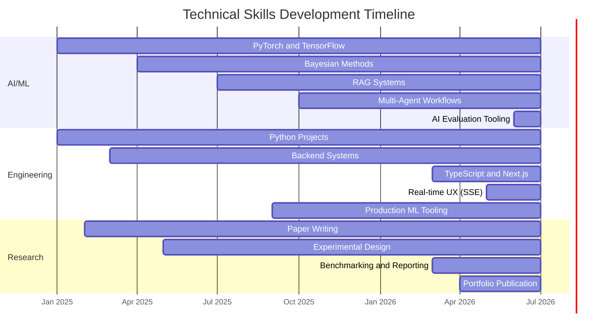

# 👋 Hi, I'm Zhichao Pan

🎓 **Computer Science Student** @ Yangzhou University Guangling College 
💻 **AI Researcher & Developer** building applied ML, RAG, multi-agent systems, and production-ready AI products 
🚀 Currently focused on reliable AI engineering, uncertainty-aware modeling, multi-agent orchestration, and full-stack TypeScript AI apps

  
  
  
  
  
  
  

## 🧭 About Me

I'm interested in building AI systems that are not only impressive in demos, but also measurable, reproducible, and useful in real-world settings. My work spans **AI for science**, **uncertainty quantification**, **financial document intelligence**, **multi-agent reasoning**, and **shipping AI-powered SaaS products with real users in mind**.

I like projects where research ideas meet engineering discipline: clean experiments, transparent evaluation, typed TypeScript, real-time UX, and systems that can be shipped, inspected, and improved.

## 🛠 Technical Focus

### 🐍 AI / Machine Learning
- **Deep Learning**: PyTorch, TensorFlow, Transformers, CNNs, ResNet, LSTM
- **Uncertainty & Bayesian Methods**: PyMC, Bayesian inference, HDI coverage, uncertainty quantification, conformal prediction
- **NLP & RAG**: LlamaIndex, LangChain, Hugging Face, embeddings, document parsing, structure-aware retrieval
- **Multi-Agent Systems**: LangGraph, custom agent orchestration, SSE streaming, local LLM workflows
- **Applied AI**: Battery prognostics, financial analysis, market intelligence, model evaluation tooling

### 💻 Software Engineering
- **Languages**: Python, TypeScript, Java, C, JavaScript
- **Backend**: Next.js App Router, FastAPI, Flask, PostgreSQL (Neon), Prisma, MongoDB, Redis
- **Frontend**: React 19, Next.js 16, Tailwind CSS v4, real-time UX (SSE)
- **DevOps**: Docker, GitHub Actions, Vercel, CI/CD, reproducible experiment pipelines
- **Cloud & Tooling**: AWS, GCP, Vercel Blob, MLflow, Weights & Biases, Vitest

### 📊 Research & Data
- **Evaluation**: Benchmarking, ablation studies, reproducibility, error analysis, cross-validated synthesis
- **Statistics**: Hypothesis testing, Bayesian modeling, experimental design
- **Visualization**: Matplotlib, Seaborn, Plotly
- **Research Practice**: Literature review, paper writing, conference preparation

## 🏆 Featured Projects

### 🚀 LaunchLens AI Suite (LaunchLens AI + Research Studio)

**An end-to-end AI SaaS suite for go-to-market strategy — from idea to actionable brief.**
- **LaunchLens AI** is the core GTM strategy workspace; the companion **Research Studio** runs **6 specialized AI agents in parallel** (Market Sizer, Competitor Analyst, Pain Detective, Pricing Scout, Channel Scout, Synthesis) to produce cross-validated market intelligence with citations and confidence scores.
- **Tech Stack**: Next.js 16, TypeScript (strict), Tailwind CSS v4, SSE real-time streaming, Vitest (73 unit tests), Vercel deployment
- **Highlights**: SSE live updates with per-agent progress, dark/light/system themes, URL-hash shareable links, Markdown / JSON / CSV exports including a `launchlensBrief` format that imports into launchlens-ai
- **Status**: Actively updated June 2026

### 🤖 Model Eval Studio

**An AI-driven multi-model evaluation workspace — upload screenshots & artifacts, get structured comparison reports.**
- **5-step wizard workflow**: task intake → AI-generated test plan → screenshot understanding & metric extraction → artifact-level deep comparison → first-person structured evaluation report (产物效果反馈 / 综合表现 / 交付效率 / 产物质量)
- **Tech Stack**: Next.js 16, TypeScript, PostgreSQL (Neon) + Prisma, Tailwind CSS v4, iron-session, AES-256-GCM for user-stored API keys, mammoth / exceljs / pdf-parse / jszip for artifacts, Vercel + Vercel Blob
- **Highlights**: Invite-code registration, users bring their own OpenAI-compatible / Anthropic-compatible keys, background-persona-aware reports (e.g. engineer / PM / HR), one-click zip export, admin console
- **Status**: Shipped June 2026

### 🔋 Safety-Critical Battery Prognostics

**A reproducible battery prognostics repository with a three-layer physics defense, bounded real-data reporting, and uncertainty-aware evaluation.**
- **Tech Stack**: PyMC, PyTorch, NASA PCoE Dataset, conformal prediction, physics-informed neural networks
- **Key Result**: Safety-focused RUL prediction with bounded uncertainty and ISO-26262-aligned evaluation
- **Impact**: Battery health management, autonomous systems, safety-critical ML

### 📈 Structure-Aware Financial RAG

**Financial document parsing with a 37.5% accuracy improvement on complex cross-row tabular reasoning.**
- **Tech Stack**: LlamaParse, LlamaIndex, RAG, DeepSeek-R1, BGE embeddings
- **Key Result**: 50.0% → 68.8% accuracy on tabular financial reasoning tasks
- **Impact**: SEC filing analysis, financial document intelligence, table-aware retrieval

### 🧠 LangGraph Financial Swarm

**Multi-agent system for financial reasoning and local-LLM orchestration.**
- **Tech Stack**: LangGraph, multi-agent systems, Ollama, local LLMs
- **Key Result**: 88.4% accuracy with 4.2% hallucination rate
- **Impact**: Automated financial research and investment analysis workflows

### 🌱 Personal Website

**Personal portfolio and digital garden built with Next.js and AI-integrated workflows.**
- **Tech Stack**: TypeScript, Next.js, modern frontend engineering
- **Focus**: Personal knowledge systems, portfolio design, AI-assisted publishing

## 📊 GitHub Analytics

  
  

  
  

  

## 🗺 Roadmap

### 🎓 Academic & Research
- Continue research in **AI for Science**, **uncertainty quantification**, and **reliable ML**
- Strengthen graduate-school and research-portfolio materials
- Turn project work into reproducible reports, benchmarks, and paper-ready artifacts

### 🛠 Engineering & Product
- Ship more complete AI applications with clear user workflows, real-time UX, and measurable outcomes
- Deepen full-stack TypeScript / Next.js / Prisma / Vercel product engineering
- Improve deployment, observability, security (AES-256 at rest), and documentation across portfolio projects

### 📚 Learning Focus
- Bayesian deep learning and causal ML
- Distributed ML systems and production ML infrastructure
- Healthcare AI, climate science, battery systems, financial AI, and AI evaluation tooling

## 📋 Project Snapshot

| Project | Area | Main Stack | Highlight |
|---------|------|------------|-----------|
| [LaunchLens AI](https://github.com/Zhi-Chao-PAN/launchlens-ai) | AI SaaS | Next.js 16, TypeScript | AI-powered GTM strategy workspace |
| [LaunchLens Research Studio](https://github.com/Zhi-Chao-PAN/launchlens-research-studio) | Multi-Agent | Next.js, SSE, Vitest | 6 parallel agents, 73 tests, multi-format export |
| [Model Eval Studio](https://github.com/Zhi-Chao-PAN/model-eval-studio) | AI Eval Platform | Next.js, Prisma, Neon, Vercel | 5-step multi-model eval, invite-only, AES-256 |
| [Battery Prognostics](https://github.com/Zhi-Chao-PAN/safety-critical-battery-prognostics) | AI for Science | PyMC, PyTorch | 3-layer physics defense, bounded uncertainty |
| [Structure-Aware RAG](https://github.com/Zhi-Chao-PAN/structure-aware-rag-empirical) | Financial AI | RAG, LlamaParse | +37.5% accuracy on tabular reasoning |
| [Financial Swarm](https://github.com/Zhi-Chao-PAN/LangGraph-Financial-Swarm) | Multi-Agent AI | LangGraph, Ollama | 88.4% accuracy, 4.2% hallucination rate |
| [Personal Website](https://github.com/Zhi-Chao-PAN/personal-website) | Portfolio | Next.js, TypeScript | AI-integrated digital garden |

## 📅 Skills Progression

## 📰 Latest Updates

- ✨ **2026-06**: Launched [Model Eval Studio](https://github.com/Zhi-Chao-PAN/model-eval-studio) — an AI-driven multi-model evaluation platform with 5-step wizard, AES-256 user-key storage, and zip export.
- 🧪 **2026-06**: Shipped [LaunchLens Research Studio](https://github.com/Zhi-Chao-PAN/launchlens-research-studio) — 6-agent parallel market intelligence with SSE streaming, 73 Vitest tests, dark mode, share links, and multi-format export.
- 🚀 **2026-06**: Extended [LaunchLens AI](https://github.com/Zhi-Chao-PAN/launchlens-ai) into a full suite with the Research Studio companion, enabling end-to-end idea → research → GTM brief.
- 🔋 **2026-04**: Continued work on safety-critical battery prognostics with three-layer physics defense and uncertainty-aware evaluation.
- 📈 **2026-03**: Published financial RAG and multi-agent financial analysis projects.
- 🌱 **Next**: Convert more project work into live demos, stronger writeups, and reproducible evaluation reports; add more real LLM providers to the eval studio.

## 🤝 Let's Connect

  
  

I'm open to:
- 👋 Collaboration on AI/ML research and product projects
- 📝 Code review, benchmark design, and technical discussion
- 💡 Idea exchange around reliable AI systems, AI evaluation, and applied research

---

  <i>"The science of today is the technology of tomorrow." — Edward Teller</i>

  
  
  

  Made with ❤️ by <a href="https://github.com/Zhi-Chao-PAN">Zhichao Pan</a> 
  Last Updated: June 19, 2026

